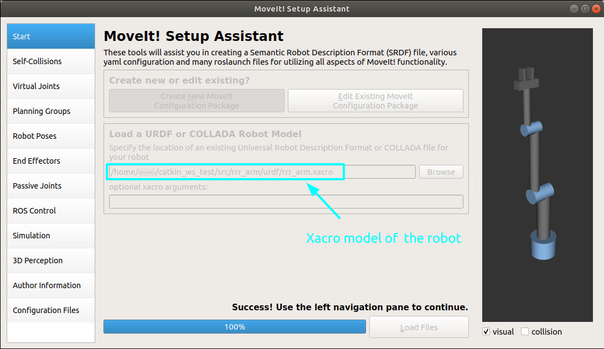
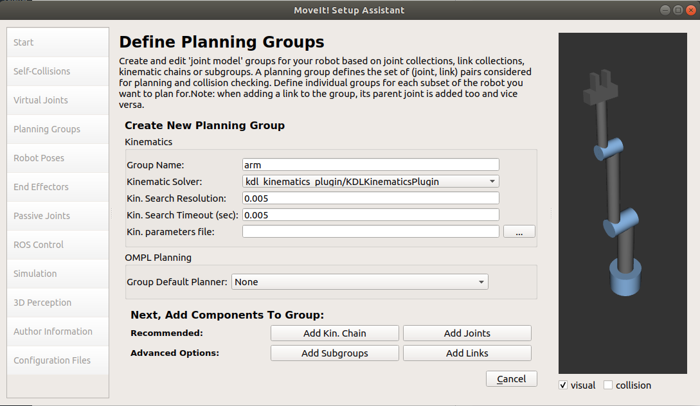
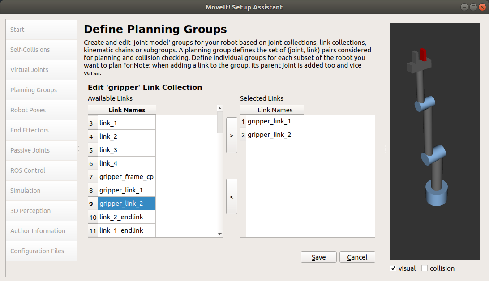
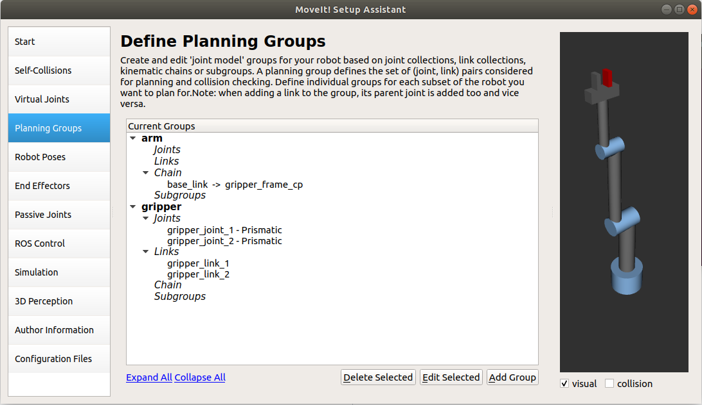
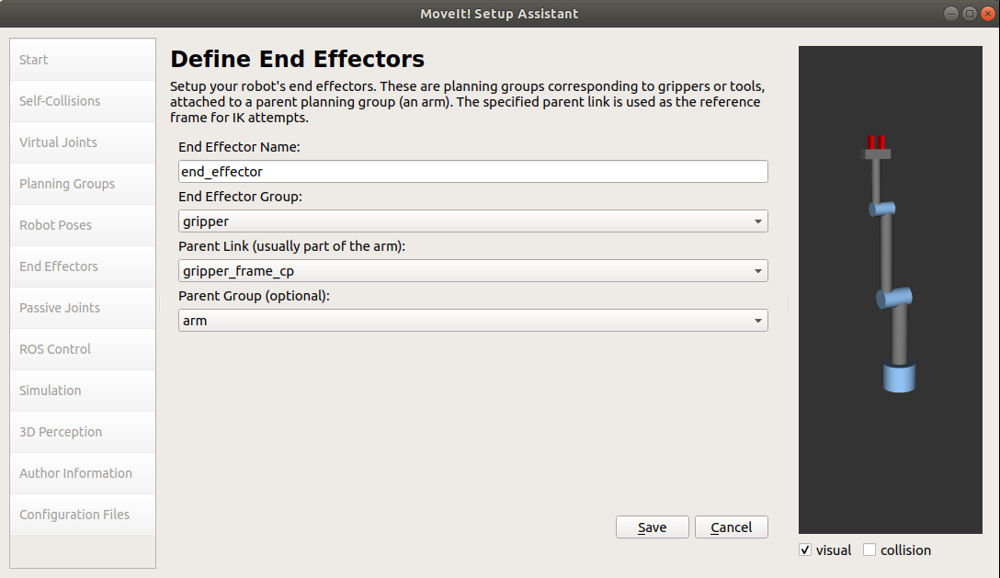
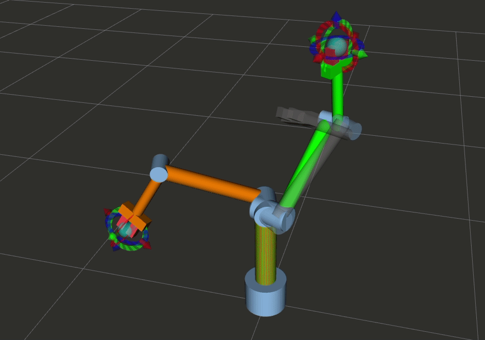
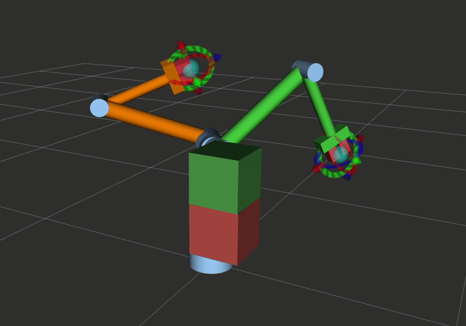
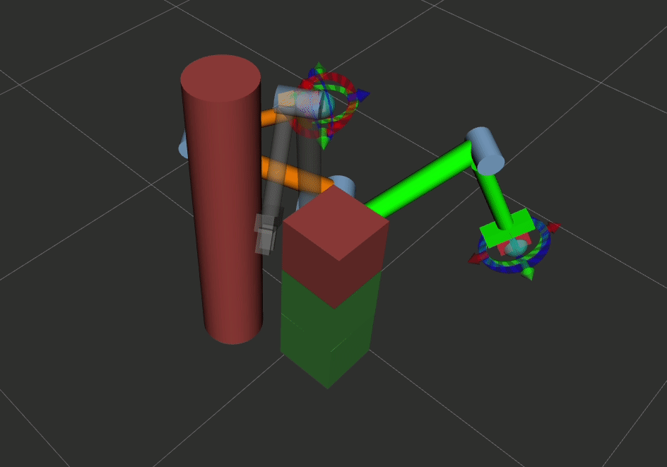

# MoveIt configuration package for RRR-robot-arm
MoveIt config package for 3 DOF Revolute-Revolute-Revolute robot arm built from scratch with steps in [this repository](https://github.com/Robotawi/rrr-arm). The aim of this package is to explain to fellow roboticists about the flow of developing MoveIt configuration packages for their robot arms. 

We start here with a xacro model that is well formatted, and parsed for visualization in Rviz smoothly. In the next step, a motion planning capability is added to the robot package. 


To use this config package, clone it and the package of the rrr_arm (which contains the model) in your ROS `workspace/src` directory as follows

```
git clone https://github.com/Robotawi/rrr_arm_config.git
git clone https://github.com/Robotawi/rrr-arm.git
```

Then, build the workspace and run it as follows
```
roslaunch rrr_arm rrr_arm_bringup_moveit.launch 
```
The ultimate goal for the two packages together is let MoveIt be interfaced with Gazebo. This step makes the transition to the real robot very smooth. 

I will explain how this MoveIt configuration package is developed and how the interface with gazebo is carried out.

## 1. How to make the MoveIt configuration package?
MoveIt setup assistant is used for this purpose and its input is the xacro or urdf model of the robot. 

We can start MoveIt setup assistant as follows
```
roslaunch moveit_setup_assistant setup_assistant.launch 
```
The steps according to the order of the tabs in the setup assistant GUI are as follows:
1. Load the URDF or Xacro file of your robot. 
2. Generate the self-collision matrix.The pairs between which no collision check will be considered. More sampling is recommended to detect links that may collide with each other.
3. Virtual joints are not needed for fixed arms, but for mobile manipulator they are needed.
4. Planning groups are very important and will be used for the interesting motion planning work that comes next. Two groups, for the arm and gripper are needed. 
	* The arm requires a kinematic chain that starts from the base link and goes to the end effector/gripper frame. KDL kinematic solver can be selected as the default solver.
	* The gripper doesn't require a kinematic solver, but the links and joints should be added in the right branches of the move group.
5. Robot poses are pre-defined robot poses that can be useful, like all zero pose or initial pose of the robot arm.
6. End effector is used to define the end effector of the robot. It requires:
	* The end effector name (say robot_eef/robot_gripper). 
	* The group name (created in step 4 for the end effector).
	* The parent link (which is the last frame of the arm grasping_frame). This is an imaginary frame that represents the tool/gripper center point.
	* The parent group, which is the arm group created in step 4 for the arm.

7. Passive joints are joints without motors/actuation, which are not very relevant to industrial manipulators. There is usually no need for setting any joints as passive for robot arms.
8. Author information of the robotic model like name and email are required for our model to be released/shared to ROS community.
9. Generating the configuration files is the last step. It creates a ROS package for the robot to be used for the motion planning and all the interesting stuff. There is a convention to name the package as `"robot_"config`. It is to be placed in the src directory of your catkin workspace to start using the robot. 
10. Exit the setup assistant.

___
<details><summary>CLICK here to see screenshots of the previous steps to make easier to follow</summary>
<p>
## Load the URDF or Xacro file of your robot


## Define the arm planning group (with kinematic chain option)

## Define the gripper planning group (with joints and links)




## Make sure the arm/gripper are well done with the chain for the arm, and links/joints for the gripper.


## Define the end effector by  attaching the gripper move_group to it. 

</p>
</details>

___


**Examples of the planned motion (start pose is green, and goal pose is orange).**

After cloning this package, we can MoveIt motion planning in Rviz with the following command
```
roslaunch rrr_arm_config demo.launch 
```



## With obstacle avoidance






## 2. How to interface MoveIt with Gazebo?
